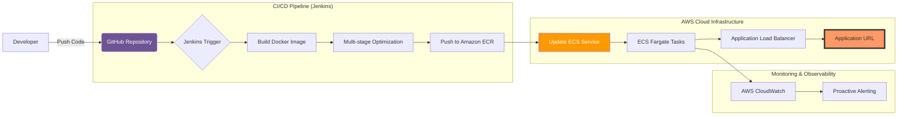

```mermaid
graph LR
    A[Developer] -->|Push Code| B(GitHub Repository)
    
    subgraph "CI/CD Pipeline (Jenkins)"
    B --> C{Jenkins Trigger}
    C --> D[Build Docker Image]
    D --> E[Multi-stage Optimization]
    E --> F[Push to Amazon ECR]
    end

    subgraph "AWS Cloud Infrastructure"
    F --> G[Update ECS Service]
    G --> H[ECS Fargate Tasks]
    H --> I[Application Load Balancer]
    I --> J[Application URL]
    end

    subgraph "Monitoring & Observability"
    H --> K[AWS CloudWatch]
    K --> L[Proactive Alerting]
    end

    style J fill:#f96,stroke:#333,stroke-width:4px
    style B fill:#6e5494,color:#fff
    style G fill:#ff9900,color:#fff
```
